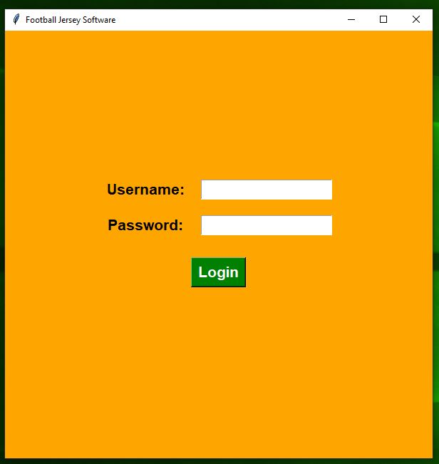
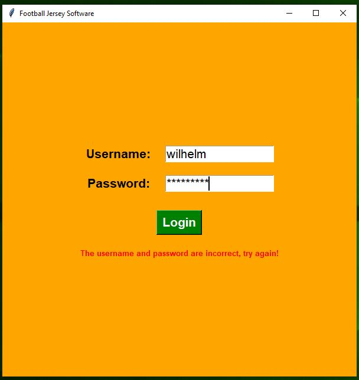
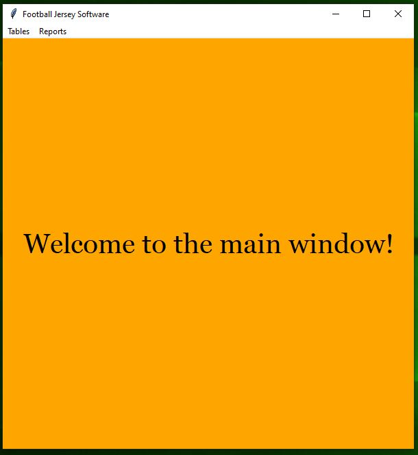
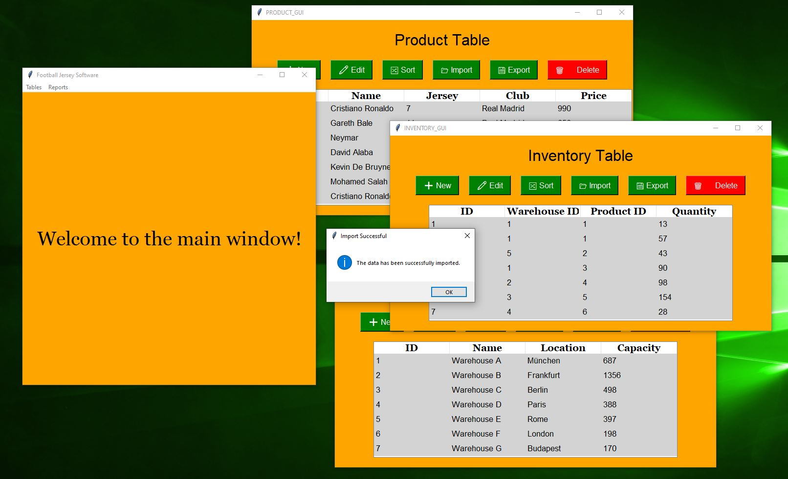
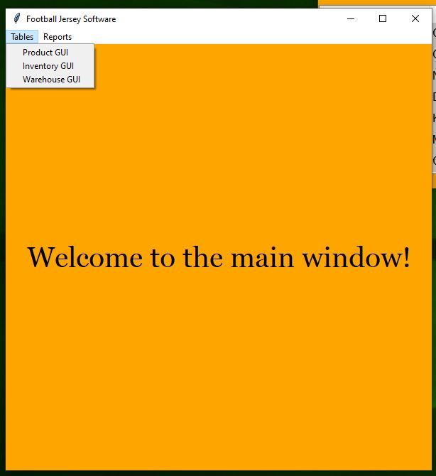
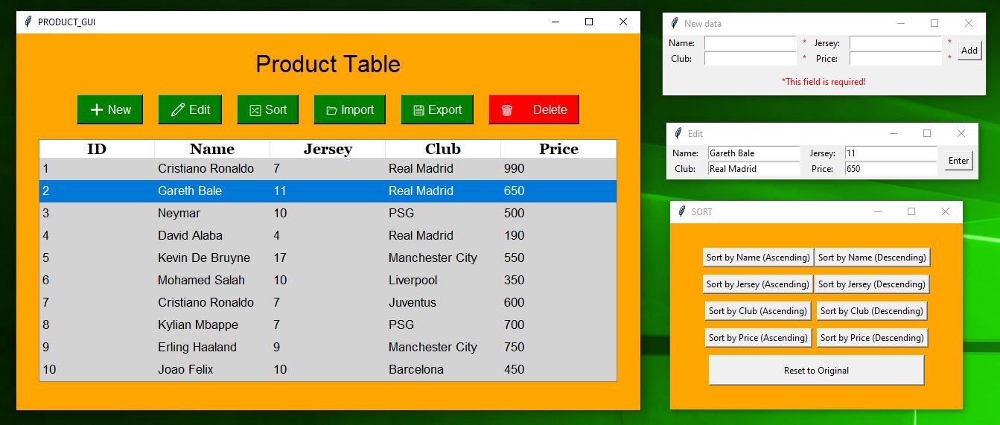
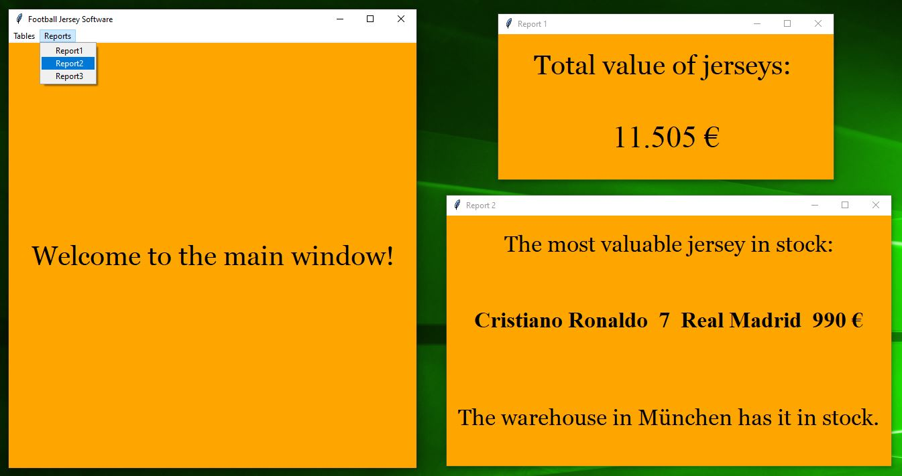
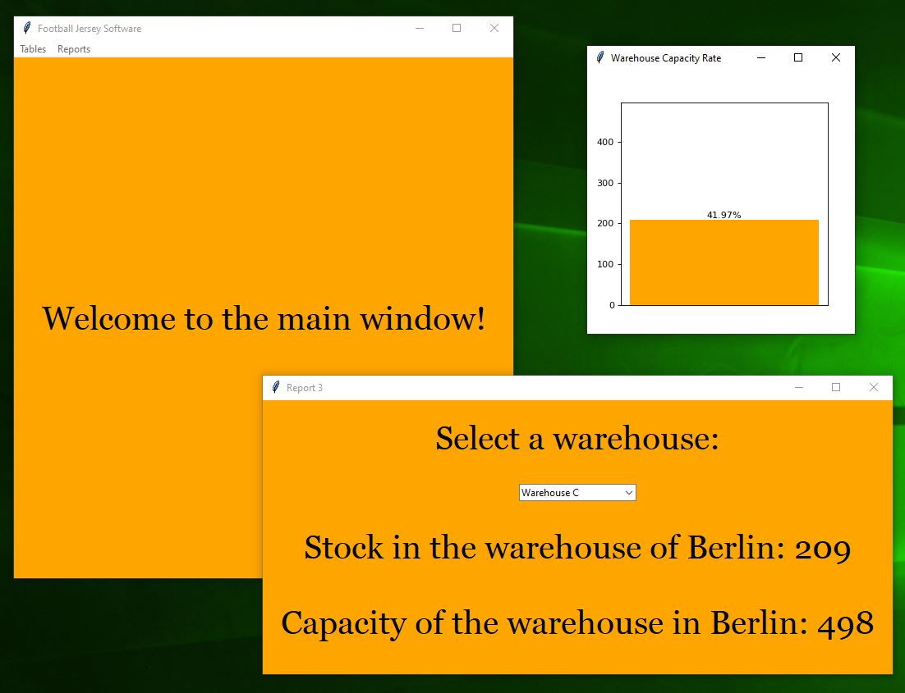

<body>
    <h1>👕 Football Jersey Inventory Management Software  </h1>
    
    
This user-friendly inventory management software made for handling football jerseys includes a main window and three extra sections where you can manage jersey details, keep track of stock in different warehouses, and store warehouse info like location and capacity. You can easily import or export data to save time. The app also gives you useful stats, like the total value of jerseys, how full each warehouse is, and which jersey is the most valuable.

    <h2>Features</h2>
    <ul>
        <li>Login interface</li>
        <li>Product, inventory, and warehouse windows</li>
        <li>Add new record</li>
        <li>Edit existing record</li>
        <li>Sort by column values</li>
        <li>Import data from external file</li>
        <li>Export data to external file</li>
        <li>Delete existing record</li>
        <li>Display total value of jerseys</li>
        <li>Show details of the most valuable jersey</li>
        <li>Display information about a user-selected warehouse</li>
    </ul>

    <h2>Tech Stack</h2>
    
    
Front-End: Tkinter 

    
    
Back-End: Python 

    
    
Database: SQLite 

    
    <h2>Main Window</h2>
    
    
    
    
    
On the home page, there is a custom question submission form where users can ask their own questions. These messages are sent directly to the site administrator's email address provided in the backend. This feature was implemented using a PHP library called PHPMailer, which handles the secure and reliable sending of emails.
    
    

    
    
    <h2>Loan Calculator</h2>
    
    
    
    
    
This section is to help users better and more quickly understand their financing options. By entering just a few details—such as the full price of the car, the interest rate, the down payment (either as an amount or a percentage), and the loan term—users can instantly calculate their estimated monthly installment. With the click of a button, the monthly payment is displayed. This feature was built using JavaScript and jQuery to ensure smooth and interactive functionality.

    
    
    
    <h2>Loan Calculator</h2>
    
    
    
    
    
This section is to help users better and more quickly understand their financing options. By entering just a few details—such as the full price of the car, the interest rate, the down payment (either as an amount or a percentage), and the loan term—users can instantly calculate their estimated monthly installment. With the click of a button, the monthly payment is displayed. This feature was built using JavaScript and jQuery to ensure smooth and interactive functionality.

    <h2>Loan Calculator</h2>
    
    
    
    
    
This section is to help users better and more quickly understand their financing options. By entering just a few details—such as the full price of the car, the interest rate, the down payment (either as an amount or a percentage), and the loan term—users can instantly calculate their estimated monthly installment. With the click of a button, the monthly payment is displayed. This feature was built using JavaScript and jQuery to ensure smooth and interactive functionality.

    <h2>Loan Calculator</h2>
    
    
    
    
    
This section is to help users better and more quickly understand their financing options. By entering just a few details—such as the full price of the car, the interest rate, the down payment (either as an amount or a percentage), and the loan term—users can instantly calculate their estimated monthly installment. With the click of a button, the monthly payment is displayed. This feature was built using JavaScript and jQuery to ensure smooth and interactive functionality.

    <h2>Loan Calculator</h2>
    
    
    
    
    
This section is to help users better and more quickly understand their financing options. By entering just a few details—such as the full price of the car, the interest rate, the down payment (either as an amount or a percentage), and the loan term—users can instantly calculate their estimated monthly installment. With the click of a button, the monthly payment is displayed. This feature was built using JavaScript and jQuery to ensure smooth and interactive functionality.

    <h2>Loan Calculator</h2>
    
    
    
    
    
This section is to help users better and more quickly understand their financing options. By entering just a few details—such as the full price of the car, the interest rate, the down payment (either as an amount or a percentage), and the loan term—users can instantly calculate their estimated monthly installment. With the click of a button, the monthly payment is displayed. This feature was built using JavaScript and jQuery to ensure smooth and interactive functionality.

    <h2>Loan Calculator</h2>
    
    
    
    
    
This section is to help users better and more quickly understand their financing options. By entering just a few details—such as the full price of the car, the interest rate, the down payment (either as an amount or a percentage), and the loan term—users can instantly calculate their estimated monthly installment. With the click of a button, the monthly payment is displayed. This feature was built using JavaScript and jQuery to ensure smooth and interactive functionality.

    
    
    
